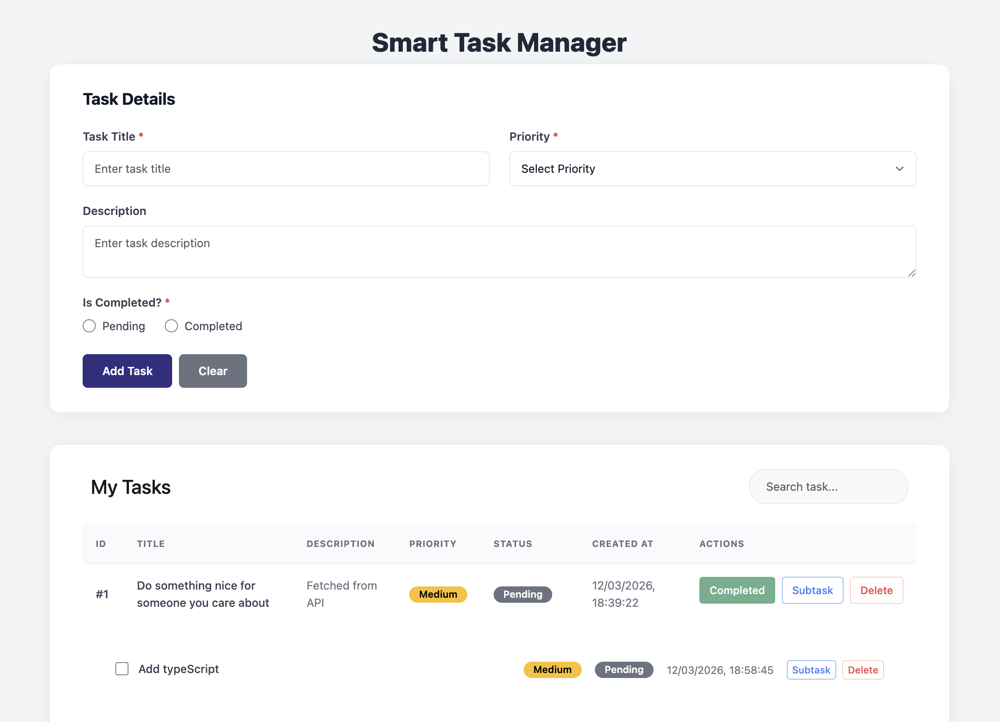

# Smart Task Manager

A lightweight **Task Management Web Application** built using **TypeScript, HTML, and CSS**.
The application allows users to create, manage, and organize tasks with nested subtasks, priority levels, and status tracking.

This project was built as part of an **Industrial Internship assignment** to demonstrate core **JavaScript and TypeScript concepts**, including prototype inheritance, recursion, generics, mixins, async/await, and modular architecture.

## Project Preview

[](https://priyanshukhakkhar.github.io/Smart-Task-Manager/)

---

# Features

• Create, update, and delete tasks
• Add **nested subtasks** (recursive structure)
• Assign **priority levels** (Low, Medium, High)
• Track **task status** (Pending / Completed)
• **Search tasks** using debounced input
• **Sort tasks** using a generic TypeScript function
• **Throttle button actions** to prevent rapid clicks
• Save tasks using **LocalStorage**
• Fetch sample tasks using **API (async/await)**
• Display loading state while fetching data

---

# Technologies Used

• TypeScript
• JavaScript (ES6+)
• HTML5
• CSS3
• LocalStorage API
• DummyJSON API

---

# Project Structure

```
Smart-Task-Manager
│
├── src
│
│   ├── models
│   │   └── task-model.ts
│
│   ├── services
│   │   ├── api-service.ts
│   │   ├── storage-service.ts
│   │   └── task-service.ts
│
│   ├── ui
│   │   ├── dom-elements.ts
│   │   └── ui-render.ts
│
│   └── App.ts
│
├── dist
├── index.html
├── style.css
├── package.json
├── tsconfig.json
└── README.md
```

---

# Core Concepts Demonstrated

### Prototype Inheritance

Implemented using constructor functions and prototype chaining.

Example:

```
function ImportantTask() {}
ImportantTask.prototype = Object.create(Task.prototype);
```

---

### Recursion

Used to manage **nested subtasks** and traverse task trees.

Functions using recursion:

* findNodeById
* deleteNodeById
* renderSubtasksHtml

---

### Debounce

Used for search input to improve performance by delaying function execution.

---

### Throttle

Used to prevent rapid button clicks and limit function execution frequency.

---

### Generics (TypeScript)

Implemented a reusable sorting function.

Example:

```
sortBy<T>(items: T[], key: keyof T)
```

---

### Mixins

Logging functionality added using a **TypeScript LoggingMixin**.

---

### Async/Await API Handling

Tasks can be fetched from an external API.

Example API:

```
https://dummyjson.com/todos
```

---

### LocalStorage Persistence

All tasks are stored locally so data persists after page refresh.

Error handling implemented using **try/catch**.

---

# Installation & Setup

Clone the repository

```
git clone https://github.com/PriyanshuKhakkhar/Smart-Task-Manager.git
```

Navigate to the project folder

```
cd Smart-Task-Manager
```

Install dependencies

```
npm install
```

Compile TypeScript

```
npx tsc
```

Open `index.html` in your browser.

---

# Demo

The application allows users to:

1. Create tasks
2. Add subtasks
3. Assign priority
4. Mark tasks as completed
5. Search and sort tasks
6. Fetch tasks from API

---

# Author

Priyanshu Khakkhar

GitHub
https://github.com/PriyanshuKhakkhar

LinkedIn
https://www.linkedin.com/in/priyanshu-khakkhar-10184a312/

---

# License

This project is created for **educational and internship demonstration purposes**.
